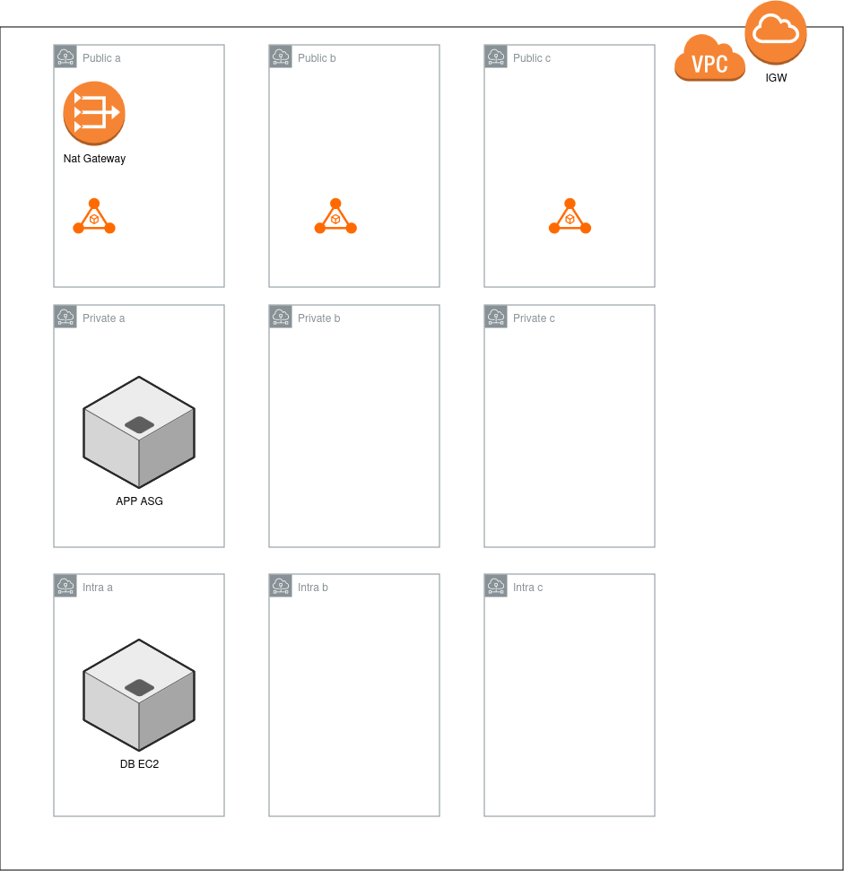

# Terraform Task
##  Explanation
A dev spec VPC has been configured with the following specification.

*   Three public, three private and three isolated subnets (for database) have been provisioned.
*   Public subnets have individual route tables with routes to IGW.
*   Private subnet share the same route table and a single NatGateway. (As this is a dev environment, hence using one NatGateway to save on hosting costs.)
*   DB subnets are totally isolated and has no access to the internet.
*   NACLs have been provisioned for each type of subnets, i-e public, private and DB.
*   Each NACL has specific rules to allow traffic in and out. These rules could have been stricter had there not been the need to install packages are boot time through user-data.
  

